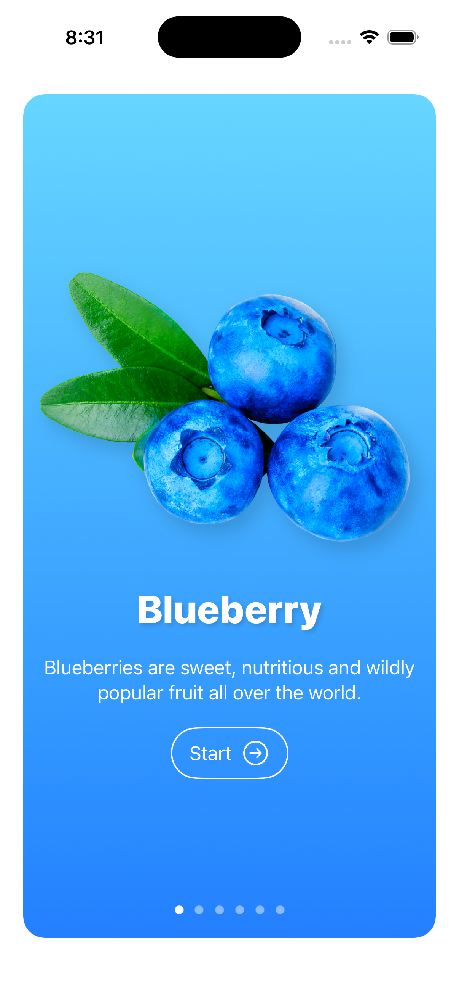
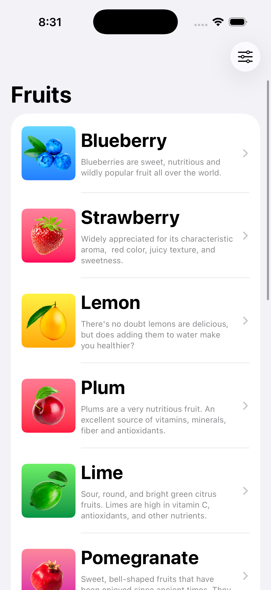
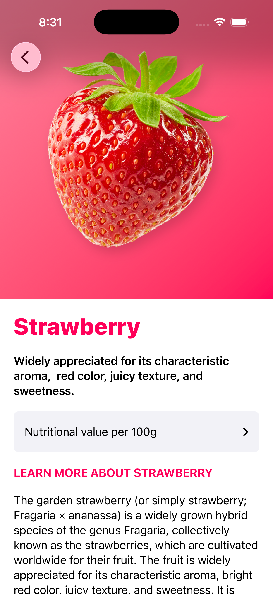
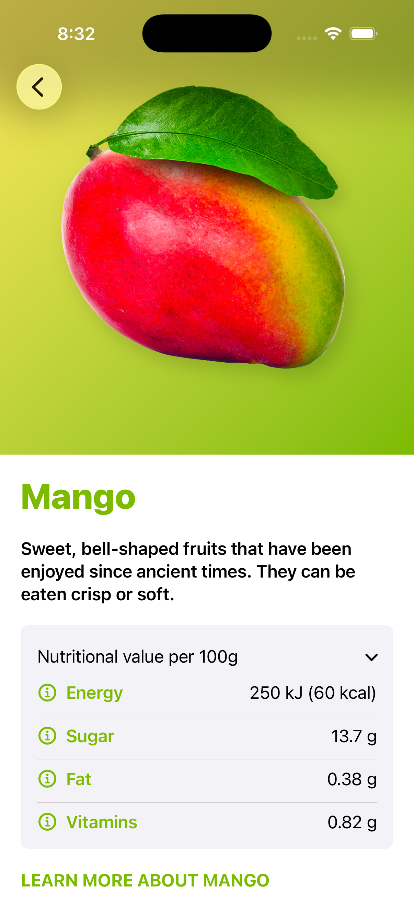

# 🍎 Fruit Shop - SwiftUI

A modern Fruit Catalog application built entirely with **SwiftUI**.

The app showcases beautiful onboarding screens, a fruit catalog, detailed nutritional information, and reusable UI components. It was built to practice modern SwiftUI development and clean project organization.

---

## 📱 Screenshots

| Onboarding | Fruit List |
|------------|------------|
|  |  |

| Fruit Details | Nutrition |
|--------------|-----------|
|  |  |

---

## ✨ Features

- 🍓 Beautiful onboarding experience
- 📋 Fruit catalog with custom list UI
- 🔍 Detailed fruit information
- 🥗 Nutritional values per 100g
- 🎨 Dynamic color themes for every fruit
- 📱 Fully built with SwiftUI
- ♻️ Reusable UI components
- 📖 Local JSON data
- 🚀 Smooth navigation between screens

---

# 🛠 Technologies

- Swift 5
- SwiftUI
- MVVM-inspired project structure
- JSON Parsing
- SF Symbols
- Xcode

---

# 📚 What I Learned

This project helped me gain practical experience with:

- SwiftUI Navigation
- NavigationStack
- ScrollView
- List
- Custom Cards
- Reusable Components
- State Management
- Property Wrappers
- Local JSON Decoding
- Image Assets
- SwiftUI Animations
- Adaptive Layouts

---

# 🚀 Getting Started

### Requirements

- Xcode 15+
- iOS 17+
- Swift 5.9+

### Clone Repository

```bash
git clone https://github.com/sandeep9607/Fruit-Shop-SwiftUI.git
```

Open the project using Xcode and run it on an iOS Simulator or a physical device.

---

# 📦 Data Source

The application uses locally stored JSON data to display fruit information including:

- Name
- Description
- Images
- Nutritional Values
- Theme Colors

No network connection is required.

---

# 🔮 Future Improvements

- Search functionality
- Favorite fruits
- Dark Mode
- SwiftData support
- Unit Tests
- Accessibility improvements
- Localization
- Network API integration

---

# 👨‍💻 Author

**Sandeep Maurya**

Senior iOS Engineer

- Swift
- SwiftUI
- UIKit
- Combine
- Swift Concurrency
- Clean Architecture

If you found this project useful, consider giving it a ⭐.
